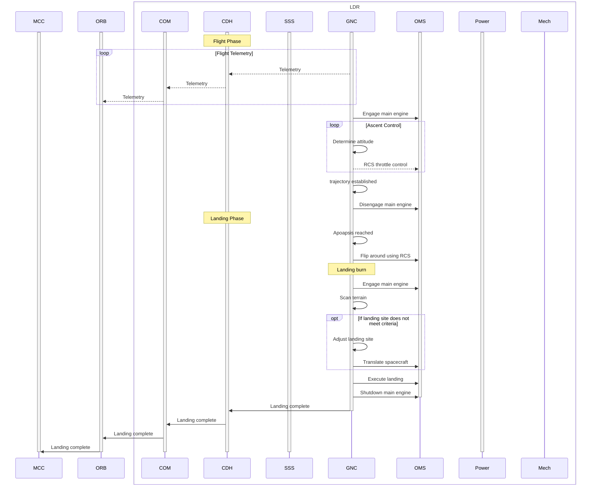

# Flight Sequence

```mermaid
sequenceDiagram
    
    participant MCC
    participant ORB

    box LDR
        participant COM
        participant CDH
        participant SSS
        participant GNC
        participant OMS
        participant Power
        participant Mech
    end

    activate ORB
    activate CDH
    activate COM
    activate SSS
    activate Power
    activate MCC
    activate GNC
    activate OMS

    Note over CDH: Flight Phase
        
        loop Flight Telemetry
            GNC -->> CDH: Telemetry
            CDH -->> COM: Telemetry
            COM -->> ORB: Telemetry
        end     
        GNC ->> OMS: Engage main engine


        loop Ascent Control
            GNC ->> GNC: Determine attitude
            GNC -->> OMS: RCS throttle control
        end

        GNC ->> GNC: trajectory established
        GNC ->> OMS: Disengage main engine

    Note over CDH: Landing Phase
        GNC ->> GNC: Apoapsis reached
        GNC ->> OMS: Flip around using RCS
        Note over GNC: Landing burn
            GNC ->> OMS: Engage main engine
            GNC ->> GNC: Scan terrain
        
            opt If landing site does not meet criteria
                GNC ->> GNC: Adjust landing site
                GNC ->> OMS: Translate spacecraft
            end

            GNC ->> OMS: Execute landing
            GNC ->> OMS: Shutdown main engine
            deactivate OMS            
            GNC ->> CDH: Landing complete
            deactivate GNC
            CDH ->> COM: Landing complete
            COM ->> ORB: Landing complete
            ORB ->> MCC: Landing complete
            

    deactivate CDH
    deactivate COM
    deactivate SSS
    deactivate Power
    deactivate ORB
    deactivate MCC
```
