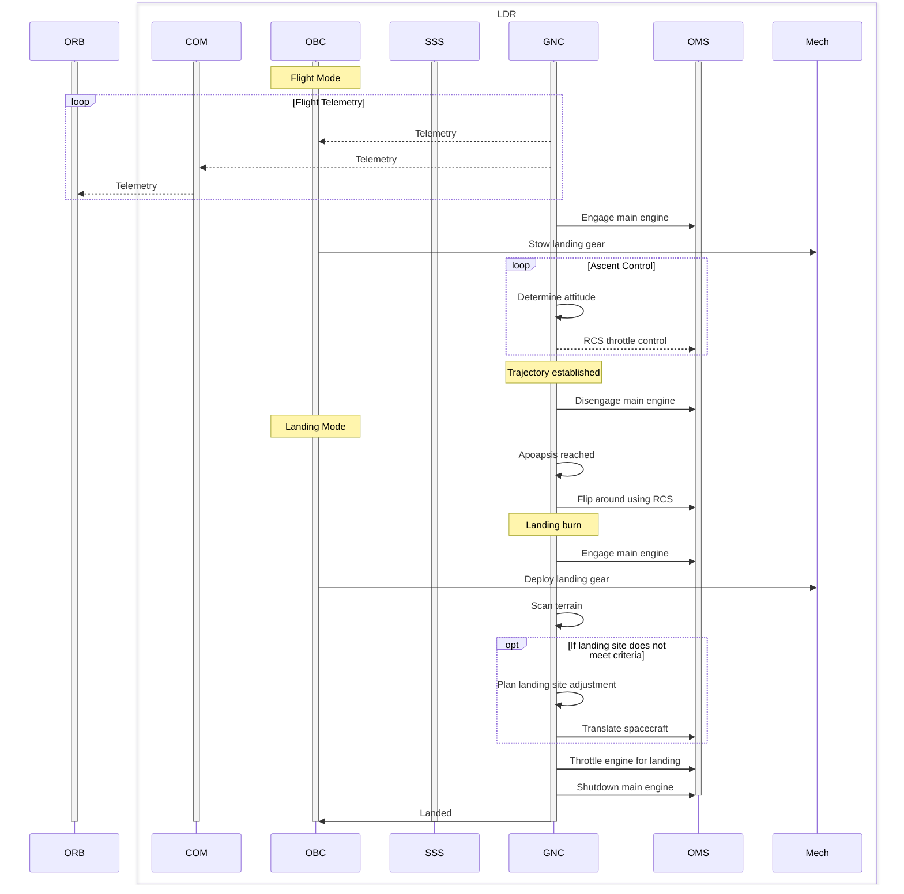

# Flight Sequence

```mermaid
sequenceDiagram

    participant ORB

    box LDR
        participant COM
        participant OBC
        participant SSS
        participant GNC
        participant OMS
        participant Mech
    end

    activate ORB
    activate OBC
    activate COM
    activate SSS
    activate GNC
    activate OMS

    Note over OBC: Flight Mode
        
        loop Flight Telemetry
            GNC -->> OBC: Telemetry
            GNC -->> COM: Telemetry
            COM -->> ORB: Telemetry
        end     
        GNC ->> OMS: Engage main engine
        OBC ->> Mech: Stow landing gear

        loop Ascent Control
            GNC ->> GNC: Determine attitude
            GNC -->> OMS: RCS throttle control
        end

        Note over GNC: Trajectory established
        GNC ->> OMS: Disengage main engine

    Note over OBC: Landing Mode
        GNC ->> GNC: Apoapsis reached
        GNC ->> OMS: Flip around using RCS
        Note over GNC: Landing burn
            GNC ->> OMS: Engage main engine
            OBC ->> Mech: Deploy landing gear
            GNC ->> GNC: Scan terrain
        
            opt If landing site does not meet criteria
                GNC ->> GNC: Plan landing site adjustment
                GNC ->> OMS: Translate spacecraft
            end

            GNC ->> OMS: Throttle engine for landing
            GNC ->> OMS: Shutdown main engine
            deactivate OMS            
            GNC ->> OBC: Landed
            deactivate GNC

    deactivate OBC
    deactivate COM
    deactivate SSS
    deactivate ORB
```
