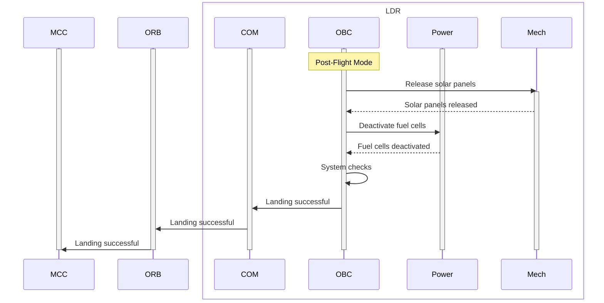

# Post-Flight Sequence

```mermaid
sequenceDiagram
    
    participant MCC
    participant ORB

    box LDR
        participant COM
        participant OBC
        participant Power
        participant Mech
    end

    activate ORB
    activate OBC
    activate COM
    activate Power
    activate MCC

    Note over OBC: Post-Flight Mode
    OBC ->> Mech: Release solar panels
    activate Mech
    Mech -->> OBC: Solar panels released
    OBC ->> Power: Deactivate fuel cells
    Power -->> OBC: Fuel cells deactivated
    OBC ->> OBC: System checks

    OBC ->> COM: Landing successful
    COM ->> ORB: Landing successful
    ORB ->> MCC: Landing successful

    deactivate OBC
    deactivate COM
    deactivate Power
    deactivate ORB
    deactivate MCC
    deactivate Mech
```
