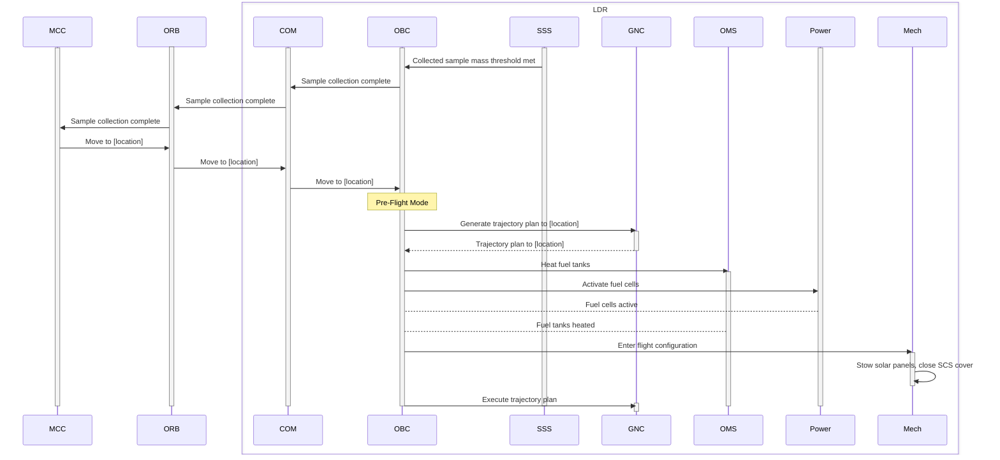

# Pre-Flight Sequence

```mermaid 
sequenceDiagram
    
    participant MCC
    participant ORB

    box LDR
        participant COM
        participant OBC
        participant SSS
        participant GNC
        participant OMS
        participant Power
        participant Mech
    end

    activate ORB
    activate OBC
    activate COM
    activate SSS
    activate Power
    activate MCC

    SSS ->> OBC: Collected sample mass threshold met
    OBC ->> COM: Sample collection complete
    COM ->> ORB: Sample collection complete
    ORB ->> MCC: Sample collection complete
    MCC ->> ORB: Move to [location]
    ORB ->> COM: Move to [location]
    COM ->> OBC: Move to [location]

    Note over OBC: Pre-Flight Mode
        OBC ->> GNC: Generate trajectory plan to [location]
        activate GNC
        GNC -->> OBC: Trajectory plan to [location]
        deactivate GNC
        OBC ->> OMS: Heat fuel tanks
        activate OMS
        OBC ->> Power: Activate fuel cells
        Power --> OBC: Fuel cells active
        OMS --> OBC: Fuel tanks heated

        OBC ->> Mech: Enter flight configuration
        activate Mech
        Mech ->> Mech: Stow solar panels, close SCS cover
        deactivate Mech
        OBC ->> GNC: Execute trajectory plan
        activate GNC
    
    deactivate OBC
    deactivate COM
    deactivate SSS
    deactivate Power
    deactivate ORB
    deactivate MCC
    deactivate GNC
    deactivate OMS
```
