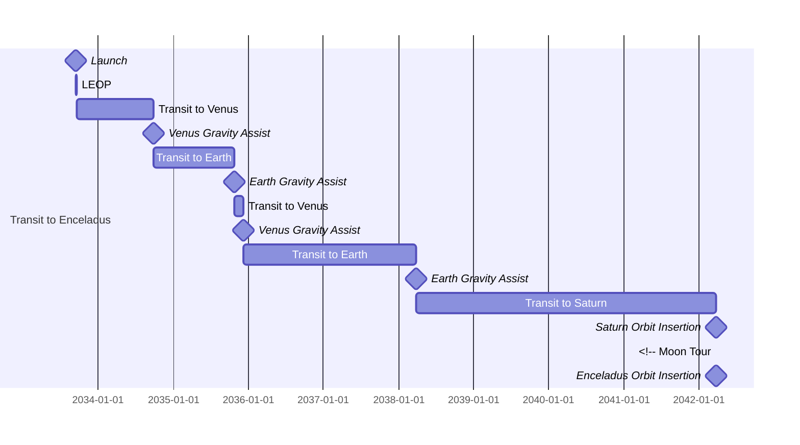
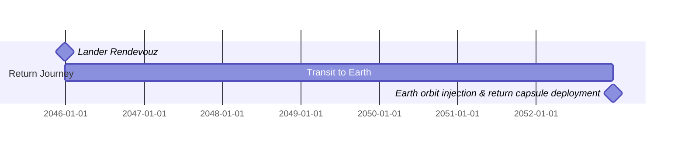

# Mission Timeline


```mermaid

gantt
    dateFormat YYYY-MM-DD
    section Enceladus Operations
        Enceladus Orbit Insertion :milestone, (unknown date),
        Reconnaissance :504h
        Lander Deployment :milestone,
        Sample collection & traversal: 1792h
        Lander Rendevouz: milestone,
```

